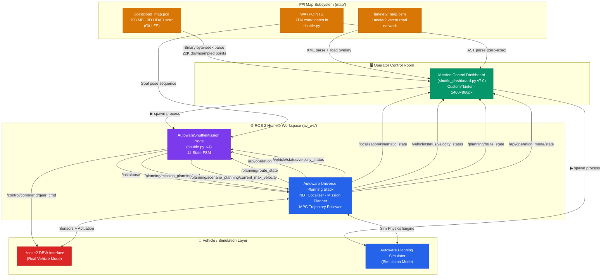
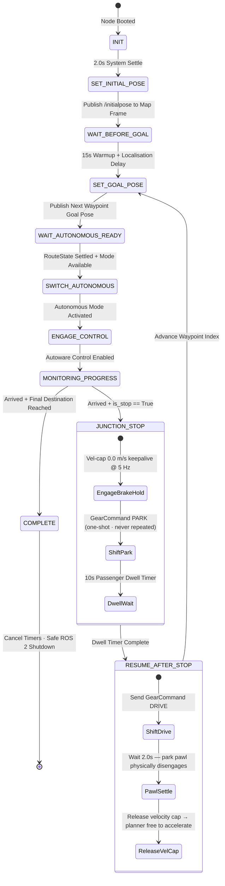
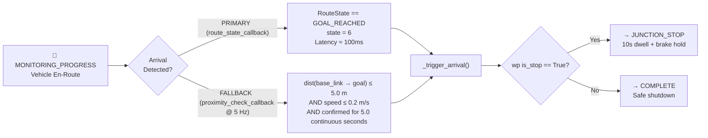
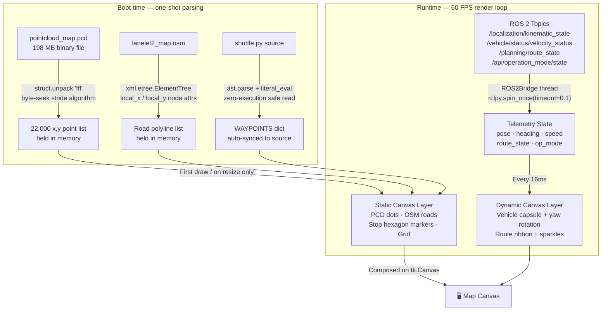

# 📐 Architecture — Autonomous Campus Shuttle

> Complete technical reference for the Autonomous Campus Shuttle system.
> For the quick-start guide, see [WALKTHROUGH.md](WALKTHROUGH.md).

---

## Table of Contents

1. [System Architecture](#1-system-architecture)
2. [ROS 2 Topic & Service Map](#2-ros-2-topic--service-map)
3. [Finite State Machine (FSM)](#3-finite-state-machine-fsm)
4. [Dual-Trigger Arrival Detection](#4-dual-trigger-arrival-detection)
5. [Data Flow](#5-data-flow)
6. [Dashboard Component Breakdown](#6-dashboard-component-breakdown)
7. [Waypoint Reference (UTM)](#7-waypoint-reference-utm)
8. [Key Bug Fixes — v4](#8-key-bug-fixes--v4)

---

## 1. System Architecture

The system has four layers: **UI (Dashboard)** → **ROS 2 Mission Node** → **Autoware Planning Stack** → **Vehicle / Simulator**, with the **Map Subsystem** feeding both the dashboard and Autoware.



---

## 2. ROS 2 Topic & Service Map

### Published by `shuttle.py`

| Topic | Message Type | Purpose |
|-------|-------------|---------|
| `/initialpose` | `geometry_msgs/PoseWithCovarianceStamped` | Set NDT/AMCL initial vehicle pose on map |
| `/planning/mission_planning/goal` | `geometry_msgs/PoseStamped` | Send next waypoint goal to Autoware planner |
| `/planning/scenario_planning/current_max_velocity` | `std_msgs/Float32` | Hold velocity at 0.0 m/s during junction stops |
| `/control/command/gear_cmd` | `autoware_vehicle_msgs/GearCommand` | PARK (one-shot) or DRIVE command to DBW |

### Subscribed by `shuttle.py`

| Topic | Message Type | Purpose |
|-------|-------------|---------|
| `/api/operation_mode/state` | `autoware_adapi_v1_msgs/OperationModeState` | Detect AUTONOMOUS / MANUAL mode transitions |
| `/planning/route_state` | `autoware_planning_msgs/RouteState` | Primary arrival trigger (`GOAL_REACHED` = state 6) |
| `/vehicle/status/velocity_status` | `autoware_vehicle_msgs/VelocityReport` | Real-time vehicle speed |
| `/tf` | TF2 transform tree | `base_link → map` for fallback proximity check |

### Subscribed by `shuttle_dashboard.py` (direct bridge)

| Topic | Purpose |
|-------|---------|
| `/localization/kinematic_state` | Real-time X,Y pose + quaternion → yaw heading |
| `/vehicle/status/velocity_status` | Speed display (m/s → km/h) |
| `/planning/route_state` | Route state badge |
| `/api/operation_mode/state` | AUTONOMOUS / MANUAL mode badge |

### Service Calls by `shuttle.py`

| Service | Purpose |
|---------|---------|
| `/api/operation_mode/change_to_autonomous` | Engage autonomous driving mode (exponential retry backoff) |
| `/api/operation_mode/enable_autoware_control` | Enable Autoware lateral + longitudinal control |

---

## 3. Finite State Machine (FSM)

`AutowareShuttleMission` dispatches its FSM handler every **500ms** via `create_timer(0.5, ...)`.



### FSM State Reference

| State | Timer | Action |
|-------|-------|--------|
| `INIT` | 2.0s | System settle before publishing |
| `SET_INITIAL_POSE` | — | Publish `/initialpose`; latch guard prevents repeat |
| `WAIT_BEFORE_GOAL` | 15.0s | Wait for NDT localiser to converge |
| `SET_GOAL_POSE` | — | Publish next waypoint as `PoseStamped` goal |
| `WAIT_AUTONOMOUS_READY` | 1.5s settle | Poll `route_state ∈ {SET, ARRIVED, FOLLOWING}` + mode OK |
| `SWITCH_AUTONOMOUS` | Exp. retry | Call `change_to_autonomous` service; backoff 1→16s |
| `ENGAGE_CONTROL` | — | Call `enable_autoware_control` service |
| `MONITORING_PROGRESS` | — | Dual-trigger arrival detection (see §4) |
| `JUNCTION_STOP` | 10.0s dwell | Vel-cap keepalive + PARK gear one-shot |
| `RESUME_AFTER_STOP` | 2.0s settle | DRIVE gear → pawl settle → release vel-cap |
| `COMPLETE` | — | Cancel all timers; `rclpy.shutdown()` |

---

## 4. Dual-Trigger Arrival Detection

Arrival is detected by **two independent mechanisms** — whichever fires first wins.



---

## 5. Data Flow



---

## 6. Dashboard Component Breakdown

```
MissionControlDashboard  (CustomTkinter · 1460 × 860px)
│
├── HEADER BAR
│   ├── Logo image + Car image
│   ├── "AUTONOMOUS SHUTTLE MISSION CONTROL"  (Courier New · Neon Cyan)
│   ├── Mode Toggle ── [SIMULATION MODE]  /  [VEHICLE CONNECT MODE]
│   └── Real-time IST Clock
│
├── LEFT PANEL  (320px · scrollable)
│   ├── MISSION ROUTING
│   │   └── Start Stop OptionMenu  ← auto-populated via AST parse of shuttle.py
│   ├── PROCESS RUNNERS
│   │   ├── Autoware Simulator Card    ▶ LAUNCH / ■ STOP   ● status LED
│   │   └── Shuttle Mission Node Card  ▶ LAUNCH / ■ STOP   ● status LED
│   └── LIVE MISSION DATA
│       ├── Speed (large display, km/h)
│       ├── Mission State Badge  (color-coded per FSM state)
│       ├── Waypoint Progress Bar
│       ├── Current Stop / Next Stop labels
│       ├── Route State indicator
│       ├── Dwell Timer countdown
│       └── Operation Mode badge  (AUTONOMOUS / MANUAL / LOCAL)
│
├── CENTER PANEL  (TabView)
│   │
│   ├── Tab 🗺️  CAMPUS MAP  (PCD + OSM)
│   │   ├── tk.Canvas  (bg #050811 — deep space black)
│   │   │
│   │   ├── STATIC LAYER  (cached · redrawn on resize only · ~10ms to build)
│   │   │   ├── 22,000 pointcloud dots  (slate-cyan · #384a62)
│   │   │   ├── Lanelet2 OSM road polylines  (slate-gray · #475569)
│   │   │   └── Stop hexagon markers  (red = junction · green = active)
│   │   │
│   │   ├── DYNAMIC LAYER  (redrawn every 16ms under "dynamic" canvas tag)
│   │   │   ├── Emerald green route ribbon  (active path ahead)
│   │   │   ├── Cyan wireframe vehicle capsule  (rotates with live yaw)
│   │   │   ├── Rotating LIDAR roof dot
│   │   │   └── Exhaust sparkle particles
│   │   │
│   │   └── [FOLLOW VEHICLE] floating button  → 3rd-person camera lock
│   │
│   └── Tab 💻  MISSION LOGS
│       └── CTkTextbox  (color-coded: INFO · WARN · ERROR · SYS · ROUTE)
│
└── RIGHT PANEL  (320px)
    ├── Speed Arc Gauge  (canvas-drawn arc)
    ├── Mission State label
    ├── Stop Segment Progress Bar
    ├── Telemetry cards  (CURRENT STOP · NEXT STOP · ROUTE STATE)
    ├── Dwell Countdown Timer
    └── Operation Mode badge
```

---

## 7. Waypoint Reference (UTM)

All coordinates are in the local UTM frame defined by `map_config.yaml`.

| # | Stop | UTM-X | UTM-Y | Alt (m) | Dwell |
|---|------|-------|-------|---------|-------|
| 0 | Security Main Gate | 42302.34 | 41729.12 | −0.25 | Pass-through |
| 1 | A-Block | 42220.48 | 41821.66 | −1.32 | ✅ 10s |
| 2 | Hostel Circle | 42194.18 | 41997.10 | +5.48 | ✅ 10s |
| 3 | CP | 42241.18 | 42075.82 | +8.18 | ✅ 10s |
| 4 | E-Block | 42365.14 | 42086.45 | +14.44 | ✅ 10s |
| 5 | WILP-Lab | 42577.55 | 42049.71 | +15.99 | ✅ 10s |
| 6 | K-Block | 42601.29 | 41917.12 | +6.68 | ✅ 10s |
| 7 | H-Block | 42532.79 | 41806.83 | +2.69 | ✅ 10s |
| 8 | I-Block | 42559.08 | 41746.37 | −3.71 | ✅ 10s |
| 9 | Security (End) | 42314.15 | 41721.62 | −0.20 | Final |

> To modify the route, edit the `WAYPOINTS` list in `shuttle.py`. The dashboard auto-syncs via AST parser on next launch.

---

## 8. Key Bug Fixes — v4

| Bug | Root Cause | Fix |
|-----|-----------|-----|
| **Clicking sound at every stop** | `GearCommand(PARK)` published at 2 Hz continuously — Hooke2 DBW re-actuates each message | `_gear_park_sent` one-shot flag: gear command sent **exactly once** per stop leg |
| **Park re-engages after DRIVE** | `_brake_hold_active` flag shared between JUNCTION_STOP and RESUME_AFTER_STOP — timer kept overriding DRIVE with PARK | Split into two independent flags: `_vel_cap_active` (keepalive) + `_gear_park_sent` (one-shot) |
| **Multiple ENGAGE calls per stop** | Shared flag cleared mid-mission; `_engage_brake_hold()` could re-fire | `_gear_park_sent` reset only in `_advance_to_next_waypoint()` — per-leg guard |
| **RESUME_AFTER_STOP missed** | Complex multi-flag dependency; state machine could miss transition | Replaced with explicit `elapsed >= threshold` gate |
| **Speed always 0.00 m/s** | Wrong message type subscribed | Correct `VelocityReport.longitudinal_velocity` + `abs()` |
| **Autonomous retry storm** | No backoff on service call failures | Exponential backoff: 1 s → 2 s → 4 s → 8 s → 16 s max |
| **Linux Tcl stack overflow** | 22,000 separate canvas `create_rectangle` calls → Tcl overflow | PIL.Image compositing → single `PhotoImage` blit per render tick |
| **DDS/X11 segfault on startup** | `rclpy` imported at module level before X11 display socket acquired | All ROS 2 imports delayed inside `ROS2Bridge.start()` method only |
