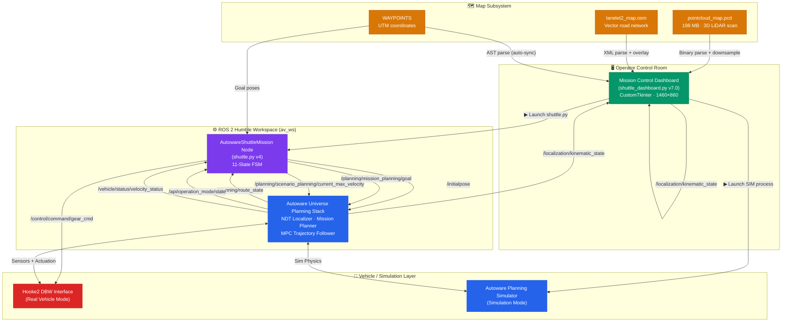
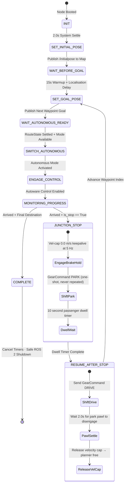
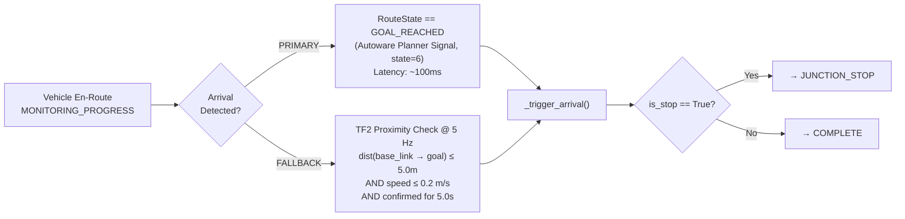
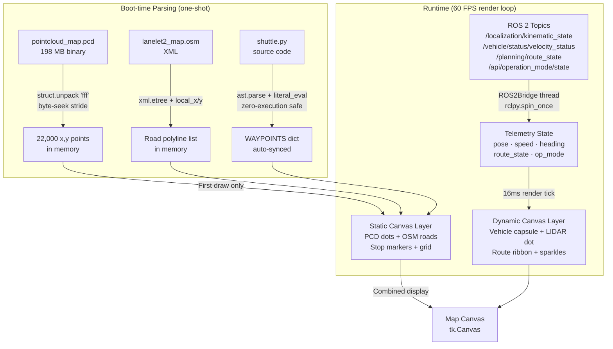

<div align="center">

# 🚌 Autonomous Campus Shuttle

**Real-time Command & Control Platform for Autonomous Vehicle Navigation**

[](https://docs.ros.org/en/humble/)
[](https://github.com/autowarefoundation/autoware.universe)
[](https://www.python.org/)
[](https://ubuntu.com/)
[](LICENSE)

</div>

---

## 🖥️ Dashboard Preview


> *Mission Control Dashboard — 22,000-point PCD map, Lanelet2 OSM road overlay, live vehicle tracking, real-time telemetry*

---

## 📋 Table of Contents

- [Overview](#-overview)
- [Key Features](#-key-features)
- [System Architecture](#-system-architecture)
- [ROS 2 Topic & Service Map](#-ros-2-topic--service-map)
- [FSM State Machine](#-finite-state-machine-fsm)
- [Data Flow](#-data-flow)
- [Dashboard Layout](#-dashboard-layout)
- [Directory Structure](#-directory-structure)
- [Installation](#-installation--setup)
- [Quick-Start Guide](#-quick-start-operation)
- [Configuration](#%EF%B8%8F-configuration)
- [Campus Route](#-campus-route)
- [Bug Fixes v4](#-key-bug-fixes-in-v4)
- [Author](#-author)

---

## 🌐 Overview

An end-to-end production platform for deploying an autonomous campus shuttle. Integrates:

- **Autoware Universe** — industry-grade AV planning and localization stack
- **ROS 2 Humble** — distributed middleware for real-time vehicle control
- **Custom Mission FSM Node** (`shuttle.py`) — 11-state Finite State Machine for deterministic, safe route execution
- **CustomTkinter Mission Control Dashboard** (`shuttle_dashboard.py`) — real-time command, visualization, and telemetry monitoring

Supports both **Simulation Mode** (Autoware Planning Simulator) and **Vehicle Connect Mode** (direct hardware deployment on Hooke2 DBW platform).

---

## ✨ Key Features

### 🤖 Autonomous Navigation Core (`shuttle.py`)
- **11-Stage FSM** — deterministic state transitions with safe recovery paths
- **Dual-Trigger Arrival Detection** — Primary: `RouteState=GOAL_REACHED`; Fallback: `/tf` proximity check (5m radius, 0.2 m/s, 5s confirmation)
- **Flexible Start Index** — start the route from any waypoint (`START_WAYPOINT_INDEX`)
- **One-Shot Gear Park** — eliminates DBW actuator clicking via `_gear_park_sent` guard flag
- **Velocity Cap Keepalive** — 5 Hz `Float32(0.0)` to `/planning/scenario_planning/current_max_velocity` during stops
- **Pawl Settle Sequence** — DRIVE → 2.0s delay → release velocity cap (safe mechanical disengagement)
- **Exponential Retry Backoff** — autonomous mode service failures: 1s → 2s → 4s → 8s → 16s max

### 🖥️ Mission Control Dashboard (`shuttle_dashboard.py` v7.0)
- **Sub-millisecond Binary PCD Loader** — `struct.unpack` byte-seek on 198 MB `.pcd` → 22,000 downsampled points rendered instantly
- **Lanelet2 OSM Road Overlay** — full campus road network parsed from `lanelet2_map.osm`
- **Direct ROS 2 Telemetry Bridge** — subscribes directly to localization, speed, route state, operation mode topics
- **Dynamic AST Waypoint Parser** — auto-syncs dashboard map to `shuttle.py` waypoint changes
- **Interactive Map** — scroll-wheel zoom (0.4×–15×), left-drag pan, 3rd-person vehicle follower camera
- **Double-Buffered 60 FPS Rendering** — static layer (PCD + OSM) cached; only dynamic layer redrawn per tick
- **Hybrid Mode Bridge** — toggle between Simulation and Vehicle Connect mode on-the-fly

---

## 🏗️ System Architecture



---

## 📡 ROS 2 Topic & Service Map

### Published by `shuttle.py`

| Topic | Message Type | Purpose |
|-------|-------------|---------|
| `/initialpose` | `PoseWithCovarianceStamped` | Set NDT/AMCL initial vehicle pose on map |
| `/planning/mission_planning/goal` | `PoseStamped` | Send next waypoint goal to Autoware planner |
| `/planning/scenario_planning/current_max_velocity` | `std_msgs/Float32` | Velocity cap — held at 0.0 m/s during stops |
| `/control/command/gear_cmd` | `GearCommand` | PARK (one-shot) / DRIVE commands to DBW |

### Subscribed by `shuttle.py`

| Topic | Message Type | Purpose |
|-------|-------------|---------|
| `/api/operation_mode/state` | `OperationModeState` | Detect AUTONOMOUS / MANUAL mode transitions |
| `/planning/route_state` | `RouteState` | Primary arrival trigger (GOAL_REACHED = 6) |
| `/vehicle/status/velocity_status` | `VelocityReport` | Real-time vehicle speed |
| `/tf` | TF2 tree | `base_link → map` fallback proximity check |

### Dashboard Direct Subscriptions (`shuttle_dashboard.py`)

| Topic | Purpose |
|-------|---------|
| `/localization/kinematic_state` | Real-time X,Y pose + quaternion → yaw heading |
| `/vehicle/status/velocity_status` | Speed display (m/s → km/h) |
| `/planning/route_state` | Route state badge |
| `/api/operation_mode/state` | AUTONOMOUS / MANUAL mode badge |

### Service Calls by `shuttle.py`

| Service | Purpose |
|---------|---------|
| `/api/operation_mode/change_to_autonomous` | Engage autonomous driving mode (with exponential retry) |
| `/api/operation_mode/enable_autoware_control` | Enable Autoware lateral + longitudinal control |

---

## 🔄 Finite State Machine (FSM)

The `AutowareShuttleMission` node runs as an **11-state FSM** dispatched every 500ms:



### Dual-Trigger Arrival Detection

To prevent single-point-of-failure on route completion, arrival is detected via **two independent mechanisms**:



---

## 📊 Data Flow



---

## 🖥️ Dashboard Layout

```
MissionControlDashboard  (1460 × 860px)
│
├── HEADER BAR
│   ├── Logo + Car Image
│   ├── "AUTONOMOUS SHUTTLE MISSION CONTROL" (Neon Cyan, Courier New)
│   ├── Mode Toggle: [SIMULATION MODE] / [VEHICLE CONNECT MODE]
│   └── Real-time IST Clock
│
├── LEFT PANEL (320px, scrollable)
│   ├── MISSION ROUTING
│   │   └── Start Stop OptionMenu  ← auto-populated from shuttle.py AST
│   ├── PROCESS RUNNERS
│   │   ├── Autoware Simulator Card  [▶ LAUNCH / ■ STOP]  ● status LED
│   │   └── Shuttle Mission Node     [▶ LAUNCH / ■ STOP]  ● status LED
│   └── LIVE MISSION DATA
│       ├── Speed (large, km/h)
│       ├── Mission State Badge (color-coded per FSM state)
│       ├── Waypoint Progress Bar
│       ├── Current Stop / Next Stop
│       ├── Route State
│       ├── Dwell Timer countdown
│       └── Operation Mode (AUTONOMOUS / MANUAL)
│
├── CENTER PANEL (TabView)
│   ├── Tab 🗺️  CAMPUS MAP (PCD + OSM)
│   │   ├── tk.Canvas (bg: #050811)
│   │   ├── STATIC LAYER (cached, redrawn on resize only)
│   │   │   ├── 22,000 pointcloud dots (slate-cyan)
│   │   │   ├── Lanelet2 OSM road polylines (slate-gray)
│   │   │   └── Stop hexagon markers (red = stop / green = active)
│   │   ├── DYNAMIC LAYER (every 16ms)
│   │   │   ├── Emerald green route ribbon
│   │   │   ├── Cyan wireframe vehicle capsule (rotates with yaw)
│   │   │   ├── Rotating LIDAR roof dot
│   │   │   └── Exhaust sparkle particles
│   │   └── [FOLLOW VEHICLE] floating button (3rd-person camera lock)
│   │
│   └── Tab 💻  MISSION LOGS
│       └── CTkTextbox — color-coded (INFO / WARN / ERROR / SYS / ROUTE)
│
└── RIGHT PANEL (320px)
    ├── Speed Arc Gauge (canvas arc drawn)
    ├── Mission State Label
    ├── Stop Segment Progress Bar
    ├── Telemetry Cards
    │   ├── CURRENT STOP
    │   ├── NEXT STOP
    │   └── ROUTE STATE
    ├── Dwell Countdown Timer
    └── Operation Mode Badge
```

---

## 📁 Directory Structure

```
Campus_Shuttle/
├── av_ws/                          # ROS 2 Humble Workspace
│   ├── src/
│   │   └── campus_pkg/             # Core Shuttle Controller Package
│   │       ├── campus_pkg/
│   │       │   ├── __init__.py
│   │       │   └── shuttle.py      # 🤖 Autonomous Navigation Node (v4, 11-state FSM)
│   │       ├── package.xml         # ROS 2 package dependencies
│   │       ├── setup.cfg
│   │       └── setup.py
│   ├── edited_launch/              # Custom autoware.launch.xml for vehicle mode
│   ├── maps/                       # Symlink to global Autoware maps directory
│   └── college.sh                  # Hardware vehicle multi-terminal launcher
│
├── map/                            # Map Assets
│   ├── lanelet2_map.osm            # Lanelet2 vector road map (XML)
│   ├── pointcloud_map.pcd          # ⚠️ 198 MB 3D LiDAR pointcloud (git-ignored)
│   ├── map_config.yaml             # Map coordinate origin (UTM/MGRS)
│   └── map_projector_info.yaml     # Projection info for Autoware
│
├── shuttle_sim_Waypoints/
│   └── waypoints.txt               # Raw UTM waypoint coordinates
│
├── .gitignore                      # Excludes build/ install/ log/ *.pcd
├── .gitattributes                  # Git LFS rules for *.pcd binary
├── Dashboard_Image.png             # 🖼️ Dashboard screenshot
├── car.jpeg                        # Vehicle image for dashboard header
├── wilp_logo.png                   # Logo displayed in dashboard header
├── logo.webp                       # Branding logo
├── shuttle_dashboard.py            # 🖥️ Mission Control Dashboard (v7.0)
├── test_dashboard.py               # Unit test suite
├── run_dashboard.sh                # Quick-launch shell script
├── push_to_github.sh               # Automated GitHub deployment script
├── requirements.txt                # Python pip dependencies
├── ARCHITECTURE.md                 # Detailed technical architecture reference
├── WALKTHROUGH.md                  # Operator step-by-step guide
└── README.md                       # This file
```

---

## 🛠️ Installation & Setup

**Prerequisites:** Ubuntu 22.04 LTS · ROS 2 Humble · Autoware Universe installed

### 1. Clone the Repository

```bash
git clone https://github.com/manish-gupta-in/Campus_Shuttle.git
cd Campus_Shuttle
```

### 2. Install Python Dependencies

```bash
pip3 install -r requirements.txt
```

### 3. Build the ROS 2 Workspace

```bash
cd av_ws
colcon build --symlink-install

# Source these in every new terminal before running
source /opt/ros/humble/setup.bash
source install/setup.bash
```

---

## 🚀 Quick-Start Operation

Run each component in a **separate terminal** in this order:

### Terminal 1 — Autoware Simulator

```bash
source /opt/ros/humble/setup.bash
source av_ws/install/setup.bash
ros2 launch autoware_launch planning_simulator.launch.xml \
    map_path:=./map
```

### Terminal 2 — Mission Control Dashboard

```bash
cd Campus_Shuttle
python3 shuttle_dashboard.py
# or simply: bash run_dashboard.sh
```

### Terminal 3 — Shuttle Mission Node

```bash
source /opt/ros/humble/setup.bash
source av_ws/install/setup.bash
ros2 run campus_pkg shuttle
```

### Hardware Vehicle Deploy (Real Mode)

```bash
# Copies custom launch XML + opens 3 coordinated terminals
cd av_ws && bash college.sh
```

Then switch the dashboard to **VEHICLE CONNECT MODE** using the top-right toggle.

---

## ⚙️ Configuration

All tunable parameters are at the top of each file:

### `shuttle.py` — Mission Tuning

```python
STOP_WAIT_SEC        = 10    # Dwell time at each junction stop (seconds)
GOAL_PUBLISH_DELAY   = 15    # Localisation warmup after initial pose (seconds)
PROXIMITY_RADIUS     = 5.0   # Fallback arrival detection radius (metres)
STOP_SPEED_THRESH    = 0.2   # Speed threshold for proximity trigger (m/s)
PROXIMITY_CONFIRM    = 5.0   # Confirmation duration for proximity arrival (seconds)
VEL_CAP_HZ           = 5     # Velocity cap keepalive rate during stops (Hz)
RESUME_GEAR_SETTLE   = 2.0   # Gear settle delay before releasing vel-cap (seconds)
START_WAYPOINT_INDEX = 0     # Start route from this waypoint (0 = first stop)
```

### `shuttle_dashboard.py` — Paths (auto-resolved, no edits needed)

```python
BASE_DIR           = os.path.dirname(os.path.abspath(__file__))  # Project root
WS_PATH            = os.path.join(BASE_DIR, "av_ws")
MAPS_PATH          = os.path.join(WS_PATH, "maps")
LANELET2_OSM_MAP   = os.path.join(BASE_DIR, "map", "lanelet2_map.osm")
POINTCLOUD_PCD_MAP = os.path.join(BASE_DIR, "map", "pointcloud_map.pcd")
```

---

## 🗺️ Campus Route

10-waypoint loop:

```
Security Main Gate → A-Block → Hostel Circle → CP →
E-Block → WILP-Lab → K-Block → H-Block → I-Block → Security (End)
```

| # | Stop | Dwell | UTM-X | UTM-Y |
|---|------|-------|-------|-------|
| 0 | Security Main Gate | Pass-through | 42302.34 | 41729.12 |
| 1 | A-Block | ✅ 10s | 42220.48 | 41821.66 |
| 2 | Hostel Circle | ✅ 10s | 42194.18 | 41997.10 |
| 3 | CP | ✅ 10s | 42241.18 | 42075.82 |
| 4 | E-Block | ✅ 10s | 42365.14 | 42086.45 |
| 5 | WILP-Lab | ✅ 10s | 42577.55 | 42049.71 |
| 6 | K-Block | ✅ 10s | 42601.29 | 41917.12 |
| 7 | H-Block | ✅ 10s | 42532.79 | 41806.83 |
| 8 | I-Block | ✅ 10s | 42559.08 | 41746.37 |
| 9 | Security (End) | Final | 42314.15 | 41721.62 |

---

## 🛡️ Key Bug Fixes in v4

| Issue | Root Cause | Fix Applied |
|-------|-----------|------------|
| **Clicking sound at stops** | `GearCommand(PARK)` at 2 Hz — DBW re-actuates each message | `_gear_park_sent` one-shot flag; gear sent **exactly once** per stop |
| **Park re-engages after DRIVE** | `_brake_hold_active` shared between JUNCTION and RESUME — timer kept re-sending PARK | Split into `_vel_cap_active` (needs keepalive) + `_gear_park_sent` (one-shot) |
| **ENGAGE calls multiple times** | Shared flag cleared mid-mission; `_engage_brake_hold()` re-fired | `_gear_park_sent` reset only in `_advance_to_next_waypoint()` — per-leg guard |
| **Speed always 0.00 m/s** | Wrong message type subscribed | Correct `VelocityReport.longitudinal_velocity` + `abs()` |
| **Autonomous retry storm** | No backoff on service call failures | Exponential backoff: 1s → 2s → 4s → 8s → 16s max |
| **Linux Tcl stack overflow** | 22,000 canvas rectangle objects → Tcl/Tk overflow | PIL.Image compositing → single `PhotoImage` blit per frame |
| **DDS/X11 segfault on startup** | `rclpy` imported at module level before X11 display acquired | Delayed import inside `ROS2Bridge.start()` only |

---

## 🧪 Tests

```bash
python3 test_dashboard.py
# Expected: all tests pass with OK
```

---

## 📦 Deployment

```bash
cd Campus_Shuttle
bash push_to_github.sh
```

> ⚠️ `map/pointcloud_map.pcd` (198 MB) is excluded via `.gitignore`. Use Git LFS to track it if needed.

---

## 👤 Author

**Manish Gupta** — Autonomous Systems & Robotics Engineer

- 🐙 **GitHub:** [@manish-gupta-in](https://github.com/manish-gupta-in)
- 💼 **LinkedIn:** [Manish Gupta](https://www.linkedin.com/in/manish-gupta-in/)
- 📧 Open for collaborations and contributions!

---

## 📄 License

MIT License — see [LICENSE](LICENSE) for details.
