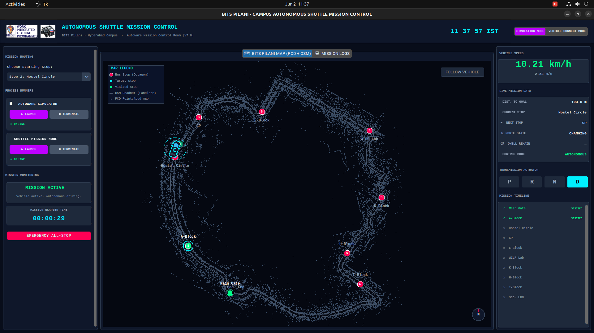

<div align="center">

# 🚌 Autonomous Campus Shuttle

**Real-time Command & Control Platform for Autonomous Vehicle Navigation**

[](https://docs.ros.org/en/humble/)
[](https://github.com/autowarefoundation/autoware.universe)
[](https://www.python.org/)
[](https://ubuntu.com/)
[](LICENSE)

</div>

---

## 🖥️ Dashboard Preview



> *Mission Control Dashboard — 22,000-point PCD map, Lanelet2 OSM road overlay, live vehicle tracking, real-time telemetry*

---

## 📋 Table of Contents

- [Overview](#-overview)
- [Key Features](#-key-features)
- [System Architecture](#-system-architecture)
- [FSM State Machine](#-finite-state-machine)
- [Directory Structure](#-directory-structure)
- [Installation](#-installation--setup)
- [Quick-Start Guide](#-quick-start-operation)
- [Configuration](#%EF%B8%8F-configuration)
- [Campus Route](#-campus-route)
- [Bug Fixes v4](#-key-bug-fixes-in-v4)
- [Deployment](#-deployment)
- [Author](#-author)

---

## 🌐 Overview

An end-to-end production platform for deploying an autonomous campus shuttle. Integrates:

- **Autoware Universe** — industry-grade AV planning and localization stack
- **ROS 2 Humble** — distributed middleware for real-time vehicle control
- **Custom Mission FSM Node** (`shuttle.py`) — 11-state Finite State Machine for deterministic, safe route execution
- **CustomTkinter Mission Control Dashboard** (`shuttle_dashboard.py`) — real-time command, visualization, and telemetry monitoring

Supports both **Simulation Mode** (Autoware Planning Simulator) and **Vehicle Connect Mode** (direct hardware deployment on Hooke2 DBW platform).

---

## ✨ Key Features

### 🤖 Autonomous Navigation Core (`shuttle.py`)
- **11-Stage FSM** — deterministic state transitions with safe recovery paths
- **Dual-Trigger Arrival Detection** — Primary: `RouteState=GOAL_REACHED`; Fallback: `/tf` proximity check (5m radius, 0.2 m/s threshold, 5s confirmation)
- **Flexible Start Index** — start the route from any waypoint (`START_WAYPOINT_INDEX`)
- **One-Shot Gear Park** — eliminates DBW actuator clicking via `_gear_park_sent` guard flag
- **Velocity Cap Keepalive** — 5 Hz `Float32(0.0)` to `/planning/scenario_planning/current_max_velocity` during stops
- **Pawl Settle Sequence** — DRIVE → 2.0s delay → release velocity cap (safe mechanical disengagement)
- **Exponential Retry Backoff** — autonomous mode service failures: 1s → 2s → 4s → 8s → 16s max

### 🖥️ Mission Control Dashboard (`shuttle_dashboard.py` v7.0)
- **Sub-millisecond Binary PCD Loader** — `struct.unpack` byte-seek on 198 MB `.pcd` → 22,000 downsampled points rendered instantly
- **Lanelet2 OSM Road Overlay** — full campus road network parsed from `lanelet2_map.osm`
- **Direct ROS 2 Telemetry Bridge** — subscribes directly to:
  - `/localization/kinematic_state` → real-time X,Y pose + quaternion→yaw
  - `/vehicle/status/velocity_status` → speed in km/h
  - `/planning/route_state` → route state string
  - `/api/operation_mode/state` → AUTONOMOUS / MANUAL badge
- **Dynamic AST Waypoint Parser** — auto-syncs dashboard map to `shuttle.py` waypoint changes
- **Interactive Map** — scroll-wheel zoom (0.4×–15×), left-drag pan, 3rd-person vehicle follower camera
- **Double-Buffered 60 FPS Rendering** — static layer (PCD + OSM) cached; only dynamic layer redrawn per tick
- **Hybrid Mode Bridge** — toggle between Simulation and Vehicle Connect mode on-the-fly

---

## 🏗️ System Architecture

```
┌──────────────────────────────────────────────────────────────────┐
│                     OPERATOR CONTROL ROOM                        │
│            shuttle_dashboard.py (CustomTkinter v7.0)             │
│  ┌──────────────┐  ┌──────────────────────┐  ┌───────────────┐  │
│  │ Left Panel   │  │   Map Canvas (PCD    │  │ Right Panel   │  │
│  │ - Start Stop │  │   + OSM + Vehicle)   │  │ - Speed Gauge │  │
│  │ - SIM Launch │  │   22K points, 60 FPS │  │ - State Badge │  │
│  │ - Node Launch│  │   Lanelet2 overlay   │  │ - Stop Info   │  │
│  └──────────────┘  └──────────────────────┘  └───────────────┘  │
└────────────────────────────┬─────────────────────────────────────┘
                             │ ROS 2 DDS Topics + Process Exec
    ┌────────────────────────▼─────────────────────────────────────┐
    │               ROS 2 HUMBLE WORKSPACE  (av_ws/)               │
    │  ┌──────────────────────────────────────────────────────┐    │
    │  │      AutowareShuttleMission Node  (shuttle.py v4)    │    │
    │  │    11-State FSM · Dual-Trigger Arrival Detection     │    │
    │  │    One-Shot Gear · Vel-Cap Keepalive · TF2 Prox     │    │
    │  └───────────────────────┬──────────────────────────────┘    │
    │  ┌───────────────────────▼──────────────────────────────┐    │
    │  │        Autoware Universe Planning Stack               │    │
    │  │   NDT Localizer · Mission Planner · MPC Controller   │    │
    │  └───────────────────────┬──────────────────────────────┘    │
    │  ┌───────────────────────▼──────────────────────────────┐    │
    │  │  Hooke2 DBW Interface (Vehicle) / Sim Physics (Sim)  │    │
    │  └──────────────────────────────────────────────────────┘    │
    └──────────────────────────────────────────────────────────────┘
                             │
    ┌────────────────────────▼─────────────────────────────────────┐
    │                MAP SUBSYSTEM  (map/)                         │
    │  pointcloud_map.pcd (198 MB) · lanelet2_map.osm · configs    │
    └──────────────────────────────────────────────────────────────┘
```

> 📖 See [ARCHITECTURE.md](ARCHITECTURE.md) for full topic/service maps, FSM diagrams, and data flow.

---

## 🔄 Finite State Machine

The `AutowareShuttleMission` node operates as an **11-state FSM**:

```
INIT → SET_INITIAL_POSE → WAIT_BEFORE_GOAL → SET_GOAL_POSE
     → WAIT_AUTONOMOUS_READY → SWITCH_AUTONOMOUS → ENGAGE_CONTROL
     → MONITORING_PROGRESS ──► JUNCTION_STOP → RESUME_AFTER_STOP
                          │         └─────────────────┘ (loop per stop)
                          └──► COMPLETE (final waypoint reached)
```

| State | Action |
|-------|--------|
| `INIT` | 2s system settle |
| `SET_INITIAL_POSE` | Publish `/initialpose` to map frame |
| `WAIT_BEFORE_GOAL` | 15s localisation warmup |
| `SET_GOAL_POSE` | Publish next waypoint to Autoware planner |
| `WAIT_AUTONOMOUS_READY` | Wait for `RouteState ∈ {SET, ARRIVED, FOLLOWING}` |
| `SWITCH_AUTONOMOUS` | Call `/api/operation_mode/change_to_autonomous` (with retry) |
| `ENGAGE_CONTROL` | Call `/api/operation_mode/enable_autoware_control` |
| `MONITORING_PROGRESS` | Monitor dual-trigger arrival |
| `JUNCTION_STOP` | Vel-cap 0.0 m/s @ 5 Hz + PARK gear one-shot + 10s dwell |
| `RESUME_AFTER_STOP` | DRIVE gear → 2s pawl settle → release vel-cap |
| `COMPLETE` | Cancel all timers, safe ROS 2 shutdown |

---

## 📁 Directory Structure

```
Campus_Shuttle/
├── av_ws/                          # ROS 2 Humble Workspace
│   ├── src/
│   │   └── campus_pkg/             # Core Shuttle Controller Package
│   │       ├── campus_pkg/
│   │       │   ├── __init__.py
│   │       │   └── shuttle.py      # Main ROS 2 Autonomous Navigation Node (v4)
│   │       ├── package.xml         # ROS 2 Package Dependencies
│   │       ├── setup.cfg
│   │       └── setup.py
│   ├── edited_launch/              # Custom Autoware launch XML configs
│   ├── maps/                       # Symlink to global Autoware maps dir
│   └── college.sh                  # Hardware vehicle multi-terminal launcher
│
├── map/                            # Campus Map Assets
│   ├── lanelet2_map.osm            # Lanelet2 Vector Map (road centerlines)
│   ├── pointcloud_map.pcd          # ⚠️ 198 MB 3D Pointcloud Map (excluded from git)
│   ├── map_config.yaml             # Map coordinate origin metadata
│   └── map_projector_info.yaml
│
├── shuttle_sim_Waypoints/
│   └── waypoints.txt               # Raw UTM waypoint coordinates
│
├── .gitignore                      # Build artifacts + large .pcd excluded
├── .gitattributes                  # Git LFS tracking rules
├── Dashboard_Image.png             # Dashboard screenshot
├── car.jpeg                        # Vehicle asset for dashboard
├── wilp_logo.png                   # Logo
├── logo.webp                       # Branding logo
├── shuttle_dashboard.py            # Mission Control Dashboard (v7.0)
├── test_dashboard.py               # Unit tests
├── run_dashboard.sh                # Quick-launch script
├── requirements.txt                # Python pip dependencies
├── ARCHITECTURE.md                 # Full technical architecture documentation
├── WALKTHROUGH.md                  # Operator quickstart guide
└── README.md                       # This file
```

---

## 🛠️ Installation & Setup

**Prerequisites:** Ubuntu 22.04 LTS · ROS 2 Humble · Autoware Universe

### 1. Clone the Repository

```bash
git clone https://github.com/manish-gupta-in/Campus_Shuttle.git
cd Campus_Shuttle
```

### 2. Install Python Dependencies

```bash
pip3 install -r requirements.txt
```

### 3. Build the ROS 2 Workspace

```bash
cd av_ws
colcon build --symlink-install

# Source in every new terminal
source /opt/ros/humble/setup.bash
source install/setup.bash
```

---

## 🚀 Quick-Start Operation

Run each component in a **separate terminal**:

### Terminal 1 — Autoware Simulator

```bash
source /opt/ros/humble/setup.bash
source av_ws/install/setup.bash
ros2 launch autoware_launch planning_simulator.launch.xml \
    map_path:=./map
```

### Terminal 2 — Mission Control Dashboard

```bash
cd Campus_Shuttle
python3 shuttle_dashboard.py
# or: bash run_dashboard.sh
```

### Terminal 3 — Shuttle Mission Node

```bash
source /opt/ros/humble/setup.bash
source av_ws/install/setup.bash
ros2 run campus_pkg shuttle
```

### Hardware Vehicle Deploy

```bash
cd av_ws && bash college.sh
```

---

## ⚙️ Configuration

### `shuttle.py` — Tuning Parameters

```python
STOP_WAIT_SEC        = 10    # Dwell time at each stop (seconds)
GOAL_PUBLISH_DELAY   = 15    # Localisation warmup after initial pose (seconds)
PROXIMITY_RADIUS     = 5.0   # Fallback arrival detection radius (metres)
STOP_SPEED_THRESH    = 0.2   # Speed threshold for proximity trigger (m/s)
PROXIMITY_CONFIRM    = 5.0   # Confirmation window for proximity arrival (seconds)
VEL_CAP_HZ           = 5     # Velocity cap keepalive rate during stops (Hz)
RESUME_GEAR_SETTLE   = 2.0   # Gear settle delay before releasing vel-cap (seconds)
START_WAYPOINT_INDEX = 0     # Start from this waypoint index (0–8)
```

---

## 🗺️ Campus Route

10-waypoint loop route:

```
Security Main Gate → A-Block → Hostel Circle → CP →
E-Block → WILP-Lab → K-Block → H-Block → I-Block → Security (End)
```

| # | Stop | Dwell |
|---|------|-------|
| 0 | Security Main Gate | Pass-through |
| 1 | A-Block | ✅ 10s |
| 2 | Hostel Circle | ✅ 10s |
| 3 | CP | ✅ 10s |
| 4 | E-Block | ✅ 10s |
| 5 | WILP-Lab | ✅ 10s |
| 6 | K-Block | ✅ 10s |
| 7 | H-Block | ✅ 10s |
| 8 | I-Block | ✅ 10s |
| 9 | Security (End) | Final destination |

---

## 🛡️ Key Bug Fixes in v4

| Issue | Root Cause | Fix |
|-------|-----------|-----|
| **Clicking sound at stops** | `GearCommand(PARK)` published at 2 Hz — DBW re-actuates each message | `_gear_park_sent` one-shot flag: gear sent **exactly once** per stop |
| **Park re-engaging after DRIVE** | Shared `_brake_hold_active` flag kept re-sending PARK during RESUME | Split into independent `_vel_cap_active` + `_gear_park_sent` flags |
| **Speed always 0.00 m/s** | Wrong message type | Correct `VelocityReport.longitudinal_velocity` + `abs()` |
| **Autonomous retry storm** | No backoff on service failures | Exponential backoff: 1s → 2s → 4s → 8s → 16s max |
| **Linux Tcl stack overflow** | 22,000 canvas objects → Tcl overflow | PIL.Image compositing → single `PhotoImage` blit |
| **DDS/X11 segfault on startup** | `rclpy` imported before X11 display ready | Delayed import inside `ROS2Bridge.start()` |

---

## 📦 Deployment

```bash
cd Campus_Shuttle
bash push_to_github.sh
```

> ⚠️ `map/pointcloud_map.pcd` (198 MB) is excluded via `.gitignore`. Use Git LFS to track it if needed.

---

## 🧪 Tests

```bash
python3 test_dashboard.py
```

---

## 👤 Author

**Manish Gupta** — Autonomous Systems & Robotics Engineer

- 🐙 **GitHub:** [@manish-gupta-in](https://github.com/manish-gupta-in)
- 💼 **LinkedIn:** [Manish Gupta](https://www.linkedin.com/in/manish-gupta-in/)
- 📧 Open for collaborations and contributions!

---

## 📄 License

MIT License — see [LICENSE](LICENSE) for details.
